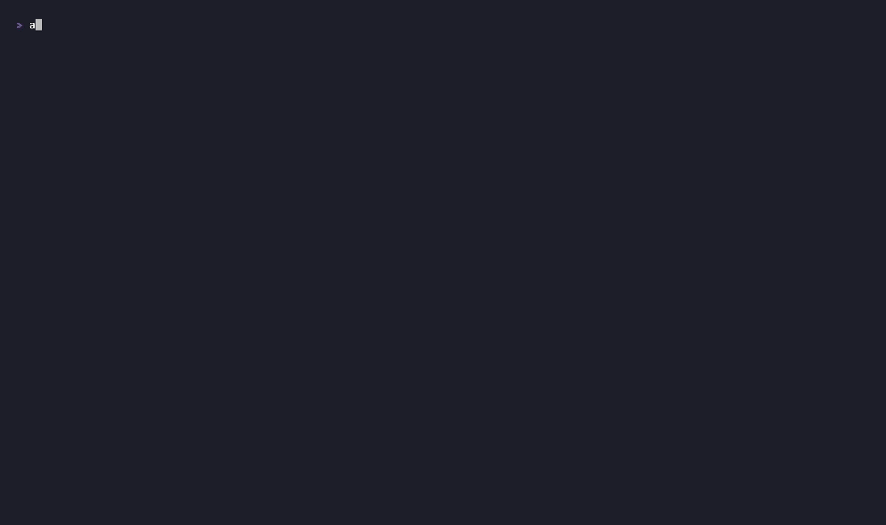

<div align="center">

# agentwatch

**See what every AI coding agent on your machine is doing — in one terminal.**

Local-only observability for Claude Code, OpenClaw, and Cursor — all the
tool calls, file reads & writes, shell commands, prompts, responses, costs,
and permissions, in a single timeline.

[](https://www.npmjs.com/package/@misha_misha/agentwatch)
[](https://github.com/mishanefedov/agentwatch/actions/workflows/ci.yml)
[](./LICENSE)
[](./package.json)

</div>

<!--
  Hero demo GIF — recorded on a real machine, ~30s, showing:
  1. `npm i -g @misha_misha/agentwatch`
  2. `agentwatch` launches, events streaming
  3. Press `?` → hotkey reference
  4. Press `P` → projects grid → Enter → sessions → Enter → scoped timeline
  5. Press Enter on a Bash event → full stdout + duration
  6. Press `p` → permissions view with flagged risks
-->

<div align="center">
  
</div>

---

## Table of contents

- [Why this exists](#why-this-exists)
- [Install](#install)
- [First 60 seconds](#first-60-seconds)
- [Features](#features)
  - [Live multi-agent timeline](#live-multi-agent-timeline)
  - [Event detail pane](#event-detail-pane)
  - [Subagent drilldown](#subagent-drilldown)
  - [Project and session navigation](#project-and-session-navigation)
  - [Full-text search](#full-text-search)
  - [Per-agent permission surface](#per-agent-permission-surface)
  - [Per-session cost with cache accounting](#per-session-cost-with-cache-accounting)
  - [Desktop notifications](#desktop-notifications)
  - [Yank to clipboard](#yank-to-clipboard)
- [Keyboard reference](#keyboard-reference)
- [What agentwatch reads](#what-agentwatch-reads)
- [Configuration](#configuration)
- [How it compares](#how-it-compares)
- [Limitations](#limitations)
- [Non-goals](#non-goals)
- [Roadmap](#roadmap)
- [Architecture](#architecture)
- [Development](#development)
- [Security](#security)
- [License](#license)

---

## Why this exists

You're running three AI coding agents on one laptop. Claude Code in a
terminal, Cursor as your IDE, OpenClaw churning on long-running tasks.
Every one of them has its own log file in a different place, its own
permission model, its own idea of what a "session" is. None of them tells
you what the others are doing.

When something goes wrong — a file rewritten unexpectedly, a spend spike,
an `rm` you don't remember running — you're piecing it together from three
JSONLs and guessing.

[`claude-devtools`](https://github.com/matt1398/claude-devtools) solves
this beautifully for Claude Code. **agentwatch does the same thing for the
whole multi-agent stack, in the terminal, with zero infra.**

- Single timeline: every agent's tool call, file op, shell exec, prompt,
  response
- Per-agent attribution: `[auraqu] Bash: git log --oneline` or `[content_agent / sub:ab3c99fc] WebFetch: https://…`
- One unified permissions view: Claude allow/deny, Cursor approval mode,
  OpenClaw sub-agents
- Local-only by design. No cloud. No telemetry. No sign-in. `lsof` will
  show you there's nothing outbound.

---

## Install

```bash
npm i -g @misha_misha/agentwatch
agentwatch
```

Requires:

- **Node ≥ 20** (tested on 20 + 22 in CI)
- **macOS or Linux** (Windows is intentionally out of scope for v0)

agentwatch is published under the `@misha_misha` npm scope — the unscoped
`agentwatch` name was already taken by a different tool from CyberArk.
Once installed the binary on your `$PATH` is simply `agentwatch`.

---

## First 60 seconds

```bash
# 1. Sanity-check that agentwatch sees your installed AI agents
agentwatch doctor
```

You should see something like:

```
workspace: /Users/you/IdeaProjects

agents:
  ● Claude Code    installed
    config: /Users/you/.claude/settings.json
  ○ Codex          not detected
    config: /Users/you/.codex/config.toml
  ● Cursor         installed
    config: /Users/you/.cursor/mcp.json
  ● Gemini CLI     installed
    config: /Users/you/.gemini/settings.json
  ● OpenClaw       installed
    config: /Users/you/.openclaw
```

Then:

```bash
# 2. Launch the TUI
agentwatch
```

You land in the live timeline. Everything your agents do from this moment
on streams in. The last ~64 KB of each active session is backfilled so you
have immediate context.

- Press **`?`** — see every hotkey
- Press **`P`** — open the projects grid (one card per workspace)
- Use Claude Code in another terminal and watch events appear
- Press **Enter** on a row to see the full content (file diff, full Bash
  output, full prompt text, extended thinking)
- Press **`q`** — quit, your shell scrollback is restored

---

## Features

### Live multi-agent timeline

The main screen. Every event your agents emit, in reverse-chronological
order by event timestamp (not arrival order — backfill from different
session files is sorted correctly). Columns: time · agent · type ·
`[project / sub-agent]` summary · duration · error flag.

```
09:54:01  openclaw     response       [content_agent] <think> Checked the knowledge base…
09:52:53  claude-code  response       [auraqu] Commit bddc363. q now exits instantly…
09:52:48  claude-code  tool_call      [auraqu] Bash: git log -5 · 12ms
09:52:43  claude-code  tool_call      [auraqu] Edit: src/ui/App.tsx · 7ms
09:51:51  claude-code  tool_call      [auraqu] Agent: Competitive landscape 2026 ▸ 52 child events
09:28:06  claude-code  prompt         [mishanefedov] I mean what's the link, do I go through…
```

Event types: `prompt`, `response`, `tool_call`, `shell_exec`, `file_read`,
`file_write`, `file_change`, `session_start`. Each gets a risk-based color
(green / yellow / orange / red) so destructive shell execs and sensitive
file writes jump out visually.

### Event detail pane

Press **`Enter`** on any focused row. Opens a full-screen pane with:

- Event metadata (time, agent, type, tool, path, cmd)
- **Tokens / cost / duration** breakdown — `in=6 cache_create=25508 cache_read=16827 out=353` · `cost: $0.08 (claude-opus-4-6)` · `duration: 151ms`
- **Tool result** — stdout / stderr for Bash, full file content for Read,
  search matches for Grep
- **Full text** — untruncated prompt or response
- **Extended thinking** block when present
- **Tool input** — JSON-pretty for Task / WebFetch / Grep arguments

Scrollable with `↑↓` or `j/k`. `esc` closes.

### Subagent drilldown

Parent `Agent` tool_use events show `▸ 52 child events`. Press **`x`** on
one to scope the timeline to only that subagent's inner tool calls — every
Bash, WebFetch, Grep, Read it ran during that Task. `X` unscopes.

This is the only multi-agent-observability feature claude-devtools has that
agentwatch matches *and* extends — because we cover non-Claude agents too.

### Project and session navigation

```
P  →  projects grid     (every workspace across every agent)
↓  →  pick one, Enter
       ↓
       sessions list     (grouped Today / Yesterday / Last 7d / Older)
       ↓  pick one, Enter
              ↓
              scoped timeline  (only events from this session)
```

Projects grid aggregates across agents: one row per filesystem path, with
per-agent session counts, total cost, last activity. Sessions list shows
the first user prompt + event count + duration + cost per session.
`esc` always walks back one level.

### Full-text search

Press **`/`**. Type a query. The timeline narrows to matches against
summary, path, cmd, tool, agent, full text, or extended thinking. Live
match count shown below the timeline. `esc` clears.

```
/ Bash: rm   →   filters to every Bash with "rm" in its command
```

### Per-agent permission surface

Press **`p`**. Scrollable view of:

- **Claude Code** — allow / deny / `defaultMode`, plus flagged risks:
  `Bash(*)` allows arbitrary shell; missing `~/.ssh` / `.aws` / `.gnupg`
  denies; auto or bypass mode surfaces as red.
- **Cursor** — approval mode, sandbox state, allow/deny counts, MCP server
  list, discovered `.cursorrules` file paths.
- **OpenClaw** — default workspace + per-sub-agent breakdown (name, emoji,
  model, workspace).

Gemini CLI is documented and omitted — it exposes no permission model
beyond auth.

### Per-session cost with cache accounting

Naive token summers are **3–10× wrong** on Claude because `cache_read` is
billed at 10% of input while `cache_creation` is billed at 125%. agentwatch
embeds a per-model rate table (opus-4-6, sonnet-4-6, haiku-4-5) and
computes true USD cost per turn.

- Per-agent total cost shows in the side panel
- Per-event cost shows in the detail pane
- Per-session cost shows in the sessions list

### Desktop notifications

Fires only for events that happen **after** the TUI was launched (backfill
is silent). Rate-limited to one alert per rule per 60s.

Triggers built-in:

- `.env` file read or write
- `~/.ssh`, `~/.aws`, `~/.gnupg` paths touched
- `rm -rf`, `sudo`, `curl | sh` in shell_exec
- Tool errors (`is_error: true`)

Platform dispatch: `osascript` on macOS, `notify-send` on Linux,
PowerShell fallback on Windows. Zero dependencies.

Custom regex triggers (e.g. "alert on any `psql.*prod`") are planned for
v0.5.

### Yank to clipboard

Press **`y`** on any focused event. Copies the most useful payload:

- Tool result content if available (the actual stdout / file body)
- Otherwise full text (prompt / response)
- Otherwise cmd / path / summary

macOS `pbcopy`, Linux `wl-copy` / `xclip` / `xsel`, Windows `clip`.
Confirmation flashes in green at the footer (`✓ copied 4,210 chars`) or red
if no clipboard tool is available.

---

## Keyboard reference

Press **`?`** anytime to open this inside the TUI.

### Navigate

| Key                | Action                                         |
| ------------------ | ---------------------------------------------- |
| `↑ ↓` / `j k`      | move selection in the timeline                 |
| `Enter`            | open event detail pane                         |
| `esc`              | close current view / clear selection           |
| `P`                | projects grid — every workspace on this machine |
| `Enter` on project | sessions list for that project (by date)       |
| `Enter` on session | scoped timeline for that session               |
| `q` / `Ctrl-C`     | quit                                           |

### Filter & scope

| Key  | Action                                                       |
| ---- | ------------------------------------------------------------ |
| `/`  | full-text search (summary, path, cmd, tool, text, thinking)  |
| `f`  | cycle agent filter (Claude only → OpenClaw only → …)         |
| `a`  | toggle agent side panel                                      |
| `x`  | drill selected Agent event into its subagent run             |
| `X`  | unscope subagent                                             |
| `A`  | clear project filter                                         |

### Actions

| Key       | Action                                      |
| --------- | ------------------------------------------- |
| `y`       | yank selected event content to clipboard    |
| `space`   | pause / resume live event stream            |
| `c`       | clear event buffer                          |

### Info views

| Key    | Action                                                    |
| ------ | --------------------------------------------------------- |
| `p`    | permissions view (Claude + Cursor + OpenClaw)             |
| `↑↓`   | scroll inside permissions or detail pane                  |

---

## What agentwatch reads

Everything is read-only. agentwatch writes to exactly two places: your
terminal, and the clipboard (on explicit `y`).

| Path                                          | What                                |
| --------------------------------------------- | ----------------------------------- |
| `~/.claude/projects/**/*.jsonl`               | Claude Code session transcripts     |
| `~/.claude/projects/**/subagents/*.jsonl`     | Claude Code Task-spawned subagents  |
| `~/.claude/settings.json`                     | Claude permissions                  |
| `~/.openclaw/agents/*/sessions/*.jsonl`       | OpenClaw sub-agent sessions         |
| `~/.openclaw/logs/config-audit.jsonl`         | OpenClaw config audit trail         |
| `~/.openclaw/openclaw.json`                   | OpenClaw agent roster               |
| `~/.cursor/{mcp.json, cli-config.json, ide_state.json}` | Cursor state               |
| Any `.cursorrules` under `$WORKSPACE_ROOT`    | Cursor project rules                |
| `$WORKSPACE_ROOT` tree (default `~/IdeaProjects`) | Filesystem change events        |

The SECURITY.md file carries the authoritative list and the details on
what is *not* read.

---

## Configuration

No config file yet — every behavior has a sensible default and the
scope is deliberately narrow. Two environment variables:

| Variable          | Default                             | Purpose                                                 |
| ----------------- | ----------------------------------- | ------------------------------------------------------- |
| `WORKSPACE_ROOT`  | `~/IdeaProjects` (fallback chain)   | Where the generic filesystem watcher looks for edits    |
| `NO_COLOR`        | unset                               | Standard honoring: disables ANSI colors if set          |

The workspace fallback chain (used when `WORKSPACE_ROOT` isn't set) is:
`~/IdeaProjects` → `~/src` → `~/code` → `~/Projects` → `~/dev` → `$HOME`.

Per-user config files and per-adapter toggles land in v0.5 alongside
custom notification triggers and budget alarms.

---

## How it compares

|                                  | agentwatch                          | claude-devtools            | Unfucked                   | Langfuse / Phoenix               |
| -------------------------------- | ----------------------------------- | -------------------------- | -------------------------- | -------------------------------- |
| Runs locally only                | ✓                                   | ✓                          | ✓                          | self-host possible               |
| Multi-agent                      | ✓ Claude + OpenClaw + Cursor        | Claude only                | agent-agnostic, file-only  | production LLM apps              |
| Per-agent event attribution      | ✓                                   | ✓                          | ✗ (file-level only)        | N/A                              |
| Permission surface view          | ✓ (Claude + Cursor + OpenClaw)      | ✗                          | ✗                          | ✗                                |
| Cost with cache-hit accounting   | ✓                                   | ✓                          | ✗                          | ✓                                |
| Subagent drilldown               | ✓                                   | ✓                          | ✗                          | ✓ (LangChain)                    |
| Install                          | `npm i -g`                          | Homebrew / Electron         | Homebrew / Rust binary     | Docker + Postgres                |
| UI                               | TUI (ink)                           | Electron + web standalone  | CLI only                   | Web                              |
| Bundle size                      | ~50 KB source                       | ~150 MB Electron app       | ~10 MB Rust binary         | Postgres + app                   |
| Telemetry                        | none                                | none                       | none                       | opt-in                           |

---

## Limitations

- **Backfill isn't unbounded.** agentwatch reads the last ~64 KB of each
  session file on startup. Older events still live in your jsonl — open
  them directly if you need deeper history.
- **Cursor activity is config-level only.** Cursor stores its full AI
  activity in a SQLite DB we don't parse yet. We capture config changes +
  recently-viewed files as a live signal. Full activity parsing is planned.
- **Gemini CLI and Codex aren't instrumented yet.** Detection works in
  `agentwatch doctor`; events don't land in the timeline. Follows in v0.4
  and v0.5.
- **macOS and Linux only.** Windows isn't supported in v0. chokidar edge
  cases and notification dispatch need more testing before we promise it.
- **Subagent correlation is best-effort.** We match parent `Agent`
  tool_use to its subagent jsonl via the `agentId` in the `tool_result`
  payload. If Claude Code changes that convention upstream, drilldown
  needs an adapter tweak.
- **The timeline window is 40 rows + header.** Scrolling deep into older
  events doesn't smoothly extend the window yet; use the projects → sessions
  drilldown or `/` search to find older events.

---

## Non-goals

Hard scope boundaries so agentwatch stays small and maintainable.

- **Not cloud. Not SaaS. Not ever.**
- **Not an agent itself.** It watches agents; it doesn't take actions.
- **Not production LLM-app tracing.** [Langfuse](https://langfuse.com)
  owns that.
- **Not enterprise compliance.** Anthropic's Compliance API covers that.
- **Not orchestration.** Use [Mission Control](https://github.com/MeisnerDan/mission-control)
  or [Stoneforge](https://stoneforge.ai) for running agents in parallel.
- **Not memory.** Use [claude-mem](https://github.com/thedotmack/claude-mem).
- **Not governance / policy enforcement.** Use [DashClaw](https://github.com/ucsandman/DashClaw)
  or [Castra](https://github.com/amangsingh/castra).

---

## Roadmap

The full, ticket-level roadmap lives in the [Linear project](https://linear.app/auraqu/project/agentwatch-748d6aa1c20a).
Headlines:

### v0.4 — parity mop-up

- 7-category token attribution (CLAUDE.md / skills / mentions / tool I/O / thinking / team / user)
- Context compaction visualizer
- Syntax highlighting in detail pane
- Markdown + JSON session export
- Stale-session detection (dim after 5 min idle)
- UX polish: breadcrumbs, consistent `esc`, home key, first-run tour

### v0.5 — moats

- User-defined regex / threshold notification triggers
- Budget alarms with hard spend caps
- OpenTelemetry exporter with rich semantic conventions
- Cross-session ripgrep-fast search
- MCP server mode — agent self-query (`get_timeline`, `get_cost`,
  `search_sessions`)
- **Web UI companion** — `agentwatch serve` on localhost:3456, same
  adapters, Preact-based renderer with inline diffs and stacked token bars

### v1.0 — ambitious

- Semantic session search ("the session where I broke the build")
- Diff-attribution (file change → prompt that caused it)
- Cross-agent session correlation (Claude → Cursor stitched)
- Tauri desktop app (3-5 MB bundle, not Electron)
- Anomaly detection (stuck loops, cost spikes, error bursts)

Feature requests: [GitHub issues](https://github.com/mishanefedov/agentwatch/issues).
Before opening one, please skim the roadmap — most ideas are already
tracked.

---

## Architecture

TypeScript monorepo shape. Three-layer mental model:

```
┌─────────────────────────────────────────────────────┐
│  TUI layer  (ink / React)                           │
│    Timeline · EventDetail · Permissions · Projects  │
│    Sessions · AgentPanel · HelpView                 │
└───────────────▲─────────────────────────────────────┘
                │  EventSink.emit / enrich
┌───────────────┴─────────────────────────────────────┐
│  Adapter layer  (per agent)                         │
│    claude-code  · openclaw  · cursor  · fs-watcher  │
└───────────────▲─────────────────────────────────────┘
                │  files read-only
┌───────────────┴─────────────────────────────────────┐
│  OS  (log files, config files, clipboard, notifier) │
└─────────────────────────────────────────────────────┘
```

- Adapters read files, translate raw log lines into a canonical
  `AgentEvent`, emit through an `EventSink`.
- The sink's `enrich(id, patch)` lets an adapter update a previously-
  emitted event (e.g. when a Claude `tool_result` arrives late and needs
  to attach duration + output to the original `tool_use`).
- The TUI is a pure reducer over the event buffer. Filtering, search,
  scope are all derived views — no mutation.

See `src/schema.ts` for the canonical event shape.

---

## Development

```bash
git clone https://github.com/mishanefedov/agentwatch.git
cd agentwatch
npm install
npm run dev           # launch the TUI directly from source (tsx)
npm test              # vitest, 14 tests
npm run typecheck     # strict TypeScript
npm run build         # tsup → dist/
```

See [CONTRIBUTING.md](./CONTRIBUTING.md) for the contribution workflow,
issue triage policy, and what's in scope for PRs.

---

## Security

Local-first is a hard invariant.

- **Zero network calls.** Verify with `lsof -i -p $(pgrep -n agentwatch)`.
- **Zero telemetry.** Not opt-in, not opt-out — simply not there.
- **All files read-only** except clipboard (on `y`) and terminal output.
- Every path agentwatch reads is documented in [SECURITY.md](./SECURITY.md).

Report vulnerabilities privately: `misha@auraqu.com` or via a
[Security Advisory](https://github.com/mishanefedov/agentwatch/security/advisories/new).

---

## License

MIT © Misha Nefedov. See [LICENSE](./LICENSE).

---

<div align="center">

If agentwatch saves you a debugging hour, a ⭐ on the repo makes the effort
worth it.

</div>
