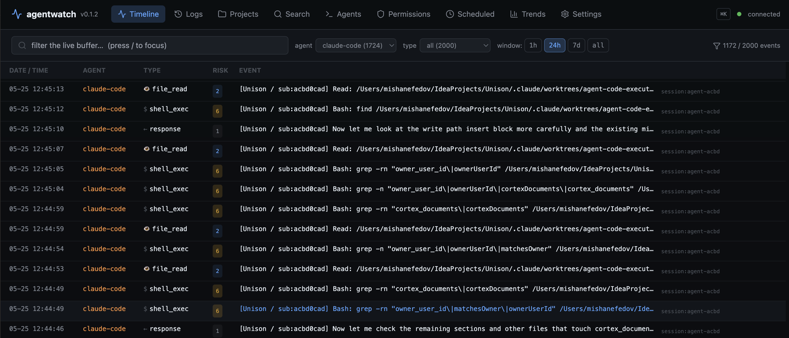
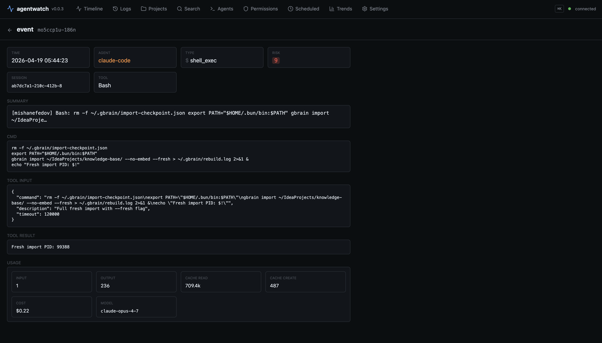

<div align="center">

# agentwatch

**Local observability + control plane for every AI coding agent on your machine.**

A terminal live-tail *and* a browser dashboard — one process, one event
stream, served from `localhost`. Unified timeline across Claude Code,
Codex, Gemini CLI, Cursor, Hermes, and OpenClaw. Token + cost accounting,
compaction + anomaly detection, hybrid search, SVG call graphs,
monaco-style diff attribution, agent-aware replay ("what would the agent
say if I edited the prompt?"), policy editor, MCP server agents can query
their own history from, and an OpenTelemetry exporter with `gen_ai.*`
semantic conventions. All local. No cloud. No telemetry. No sign-in.

[](https://www.npmjs.com/package/@misha_misha/agentwatch)
[](https://github.com/mishanefedov/agentwatch/actions/workflows/ci.yml)
[](./LICENSE)
[](./package.json)

</div>

<div align="center">
  
  <br />
  
</div>

**The TUI is the live tail. The web UI is where you drill in** — projects,
sessions, token charts, compaction sparklines, SVG call graphs, diff
attribution, replay, anomaly triage, policy editing. Both run in one
process. Press `w` in the TUI to open the browser.

---

## Table of contents

- [Why this exists](#why-this-exists)
- [Install](#install)
- [First 60 seconds](#first-60-seconds)
- [Agent coverage](#agent-coverage)
- [Features](#features)
- [Keyboard reference](#keyboard-reference)
- [Configuration](#configuration)
- [What agentwatch reads](#what-agentwatch-reads)
- [MCP server mode](#mcp-server-mode)
- [OpenTelemetry exporter](#opentelemetry-exporter)
- [How it compares](#how-it-compares)
- [Limitations](#limitations)
- [Non-goals](#non-goals)
- [Architecture](#architecture)
- [Development](#development)
- [Security](#security)
- [License](#license)

---

## Why this exists

You run three AI coding agents on one laptop. Claude Code in a terminal,
Codex alongside it, Cursor as your IDE, maybe Gemini CLI for a quick
review, maybe an OpenClaw sub-agent churning on a long task. Every one of
them has its own log file, its own permission model, its own idea of what
a "session" is. None of them tells you what the others are doing.

When something goes wrong — a file rewritten unexpectedly, a spend spike,
an `rm` you don't remember running — you're piecing it together from five
JSONLs and guessing.

[`claude-devtools`](https://github.com/matt1398/claude-devtools) does this
well for Claude Code. **agentwatch does it for the whole multi-agent
stack, in the terminal, with zero infrastructure and zero network.**

---

## Why this over `claude-devtools` if you run multiple agents?

Short, factual diff. `claude-devtools` is a great tool for Claude-only
workflows — if you only use Claude Code, it's probably the better pick.
agentwatch is the answer when you run more than one agent on the same
machine and want one timeline + one cost ledger + one alerting surface
across all of them.

| What                                         | claude-devtools         | **agentwatch**                        |
| -------------------------------------------- | ----------------------- | ------------------------------------- |
| Claude Code coverage                         | ✅ full                 | ✅ full                               |
| Codex coverage                               | ❌                      | ✅ tokens + tools + cost + compaction |
| Gemini CLI coverage                          | ❌                      | ✅ tokens + tools + cost              |
| OpenClaw coverage                            | ❌                      | ✅ tokens + cost                      |
| Hermes Agent coverage                        | ❌                      | ✅ tokens + tools + cost (SQLite)     |
| Cursor coverage                              | ❌                      | 🟡 config level                       |
| Per-agent budget alarms                      | ❌                      | ✅ session + daily caps                |
| Statistical anomaly detection (loops / spikes) | rule-based only      | ✅ MAD z-score + period-1-to-4 loops  |
| OpenTelemetry exporter (`gen_ai.*`)          | ❌                      | ✅ Jaeger / Tempo / Grafana ready      |
| MCP server — agents query their own history  | ❌                      | ✅ 5 tools over stdio                  |
| User-defined regex/threshold triggers        | ❌                      | ✅ live-reloaded                       |
| Install                                      | Homebrew / Electron ~150 MB | `npm i -g` · 220 KB · TUI          |
| Data boundary                                | local                   | local                                 |

If "every agent on one pane of glass + programmatic access via MCP +
pipeline-friendly OTel" matches your setup, agentwatch is the tool.
If you're Claude-only and want the Electron polish, `claude-devtools`
is still excellent.

---

## Install

```bash
npm i -g @misha_misha/agentwatch
agentwatch
```

Requires:

- **Node ≥ 20** (tested on 20 + 22 in CI)
- **macOS or Linux** (Windows intentionally out of scope for v0.x)

Published under the `@misha_misha` npm scope — the unscoped `agentwatch`
name was already taken by a CyberArk tool. The installed binary on your
`$PATH` is simply `agentwatch`.

---

## First 60 seconds

```bash
agentwatch doctor   # detects installed agents + readiness
agentwatch          # TUI live-tail + web UI at http://127.0.0.1:3456
agentwatch serve    # web UI only (remote boxes / server cron)
agentwatch mcp      # runs the MCP stdio server (for agents, not humans)
agentwatch --help
```

Flags:

- `--no-web` — TUI only, don't start the web server
- `--port <n>` / `--host <addr>` — override web server bind
- `AGENTWATCH_PORT=… AGENTWATCH_HOST=…` — env equivalents

`doctor` output looks like:

```
workspace: /Users/you/IdeaProjects

agents:
  ● Claude Code        installed (events captured)
  ● Codex              installed (events captured)
  ● Gemini CLI         installed (events captured)
  ● Hermes Agent       installed (events captured)
  ● Cursor             installed (config-level only)
  ● OpenClaw           installed (events captured)
  ○ Aider              not detected
  ○ Cline (VS Code)    not detected
```

Launch `agentwatch` and every event your agents emit streams in. The TUI
shows a live tail; the web UI at `http://127.0.0.1:3456` is where you
drill in — projects, sessions, token charts, SVG call graphs, diff
attribution, prompt replay, trends. Press `w` in the TUI to open it.

### Web UI map

| Route                                | What it is                                              |
| ------------------------------------ | ------------------------------------------------------- |
| `/`                                  | Live timeline (SSE-streamed) with agent + type filters  |
| `/projects`                          | Grid of detected projects + cost + session counts       |
| `/projects/:name`                    | Sessions table for one project                          |
| `/sessions/:id`                      | Chronological event list · export .md / .json           |
| `/sessions/:id/tokens`               | Stacked-area token chart per turn                       |
| `/sessions/:id/compaction`           | Context fill % over time + compaction markers           |
| `/sessions/:id/graph`                | Call graph (d3-hierarchy SVG) — click nodes to drill    |
| `/sessions/:id/diffs`                | Writes paired with the prompt that triggered them       |
| `/sessions/:id/replay`               | Edit prompt → re-run the agent in single-turn exec      |
| `/search`                            | Unified search (live / cross / semantic)                |
| `/agents`                            | Grid of every supported agent + install status          |
| `/permissions`                       | Per-agent permission config                             |
| `/cron`                              | OpenClaw cron jobs + heartbeats                         |
| `/trends`                            | Cost, cache-hit ratio, events per agent (30d default)   |
| `/settings/{budgets,anomaly,triggers}` | Form editors for `~/.agentwatch/*.json`                |

`⌘K` / `Ctrl+K` opens the command palette.
`/` focuses the timeline filter.

---

## Agent coverage

What actually works per agent, as of v0.0.3. Features not listed here
work across every agent (timeline, export, syntax highlighting, notifications,
triggers, search, stale detection, clipboard yank).

| Feature                        | Claude Code | Codex | Gemini CLI | Cursor | OpenClaw | Hermes |
| ------------------------------ | :---------: | :---: | :--------: | :----: | :------: | :----: |
| Live events on timeline        | ✅          | ✅    | ✅         | 🟡     | ✅       | ✅     |
| Token usage + cost             | ✅          | ✅    | ✅         | ❌     | ✅       | ✅     |
| Tool call + result pairing     | ✅          | ✅    | ✅         | ❌     | 🟡       | ✅     |
| Per-turn token attribution     | ✅          | ✅    | ✅         | ❌     | ✅       | ✅     |
| Budget alarms (session + day)  | ✅          | ✅    | ✅         | ❌     | ✅       | ✅     |
| Anomaly detection (cost/loops) | ✅          | ✅    | ✅         | 🟡     | ✅       | ✅     |
| Compaction visualizer          | ✅          | ✅    | ❌         | —      | ❌       | ❌     |
| Permissions view               | ✅          | ✅    | ✅         | ✅     | ✅       | —      |
| Cross-session search           | ✅          | ✅    | ✅         | ❌     | ❌       | 🟡     |
| Subagent drilldown             | ✅          | —     | 🟡         | —      | 🟡       | 🟡     |
| Replay (agent-aware exec)      | ✅          | ✅    | ✅         | ❌     | ❌       | ✅     |
| Agent memory file overhead     | `CLAUDE.md` | `AGENTS.md` | `GEMINI.md` | `.cursorrules` | `OPENCLAW.md` | `SOUL.md` |
| OTel span coverage             | ✅          | ✅    | ✅         | 🟡     | ✅       | 🟡     |
| MCP server exposes history     | ✅          | ✅    | ✅ (raw)   | ❌     | ❌       | ❌     |

- **Cursor** exposes config state (MCP servers, `.cursorrules`, approval
  mode, sandbox) but its actual AI activity lives in a SQLite database we
  haven't parsed yet. A thin read-only adapter is a follow-up.
- **Gemini CLI** doesn't persist context-compaction markers to disk, so
  compaction detection is Claude + Codex only.
- **OpenClaw** doesn't persist tool_result content or compaction markers
  to its JSONL — structural limit of what's on disk, not an adapter gap.
- **[Hermes Agent](https://github.com/NousResearch/hermes-agent)** (by
  Nous Research — the OpenClaw successor with a closed learning loop)
  persists sessions to `~/.hermes/state.db` (SQLite + FTS5). The adapter
  polls the DB over chokidar + 2s safety-net and emits the full
  session/prompt/response/tool-call stream. Replay re-runs single turns
  via `hermes chat -q <prompt> -Q --max-turns 1`.

---

## Features

### Live multi-agent timeline

Main screen. Every event your agents emit, ordered by event timestamp (not
arrival order, so backfill from different sessions merges correctly).
Columns: time · agent · type · `[project]` summary · duration · error.

```
09:54:01  openclaw     response       [content_agent] <think> Checked the KB…
09:52:53  claude-code  response       [auraqu] Commit bddc363. q now exits instantly…
09:52:48  codex        shell_exec     [dataset_research] ls -la · 12ms
09:52:43  claude-code  tool_call      [auraqu] Edit: src/ui/App.tsx · 7ms
09:51:51  gemini       file_write     [landing] write_file: public/llms.txt
09:51:51  claude-code  tool_call      [auraqu] Agent: Competitive landscape ▸ 52 child events
```

Rows with an anomaly fire a red `◎` prefix on the type column.

### Event detail pane

Press **`Enter`** on any row. Opens a full-screen pane with:

- Metadata (time, agent, type, tool, path, cmd)
- Tokens / cost / duration (`in=6 cache_create=25508 cache_read=16827 out=353` · `$0.08 (claude-opus-4-6)` · `151ms`)
- Tool result — stdout for Bash, file content for Read/Write, search matches for Grep — with syntax highlighting inferred from the tool + file extension
- Full prompt or response text
- Extended thinking block when present
- Tool input JSON

Scrollable with `↑↓` or `j/k`. `esc` closes.

### Subagent drilldown

Parent `Agent` tool_use events show `▸ 52 child events`. Press **`x`** to
scope the timeline to only that subagent's inner tool calls. `X` unscopes.
Applies to Claude Code (Task tool) and partially to OpenClaw (per-agent
delegation) and Gemini (subagent sessions).

### Project + session navigation

```
P → projects grid (one workspace per row, across all agents)
     ↓ enter → sessions list (grouped Today / Yesterday / 7d / Older)
             ↓ enter → scoped timeline
```

Projects grid aggregates across agents: per-agent session counts, total
cost, last activity. `esc` walks back one level.

### Cross-session search (`?`)

Press **`?`** — fuzzy-substring search across every session file on disk
(`~/.claude`, `~/.codex`, `~/.gemini`). Uses ripgrep if installed, falls
back to a native scan. Enter on a hit scopes the timeline to that session.

Different from in-buffer search:
- **`/`** — search the 500-event live buffer
- **`?`** — search every session file ever written

### Per-session cost with cache accounting

Naive token counters are 3–10× wrong on Claude because `cache_read` is
billed at 10% of input and `cache_creation` at 125%. agentwatch ships a
per-model rate table (Claude opus/sonnet/haiku, GPT-5 / GPT-5-mini,
Gemini 2.5 Pro/Flash) and computes true USD cost per turn. Cost shows:

- Per-agent total in the side panel
- Per-event in the detail pane
- Per-session in the sessions list
- Aggregate in the session's token attribution view (`[t]`)

### Per-turn token attribution (`[t]`)

Inside a scoped session, press **`t`**. Stacked bar per turn showing:

- `user` — the preceding prompt (tokenized with `gpt-tokenizer`)
- `memory file` — CLAUDE.md / AGENTS.md / GEMINI.md / .cursorrules / etc., read from the session's cwd
- `tool I/O` — tool_input JSON + tool_result text
- `thinking` — extended thinking block
- `input (fresh)` / `cache read` / `cache create` / `output` — exact from the model's own usage record

### Compaction visualizer (`[C]`)

Inside a scoped session, press **`C`**. Horizontal bar of context fill %
across turns, with `⋈` markers where the agent auto-compacted. Selected
compaction shows before / after token counts and the dropped-token delta.
Works on Claude Code (via `isCompactSummary`) and Codex (via
`event_msg/turn_truncated`).

### Budget alarms

`~/.agentwatch/budgets.json`:

```json
{ "perSessionUsd": 5, "perDayUsd": 20 }
```

Red banner in the Header when either cap is crossed; OS notification
fires once per crossing. No kill switch — we don't control agents; we
just shout.

### Anomaly detection

Three detectors, all fully local, all running on the 500-event buffer:

- **MAD z-score outliers** on cost, duration, and input tokens per agent
  (`|z| > 3.5` by default — tune in `~/.agentwatch/anomaly.json`)
- **Stuck-loop detector** with periods 1–4 — catches `A-A-A-…` and
  `A-B-A-B-…` "apologize and retry" loops
- Per-session rollup + OS notification on first flag + timeline `◎` marker
  + `[D]` to dismiss the banner

### User-defined notification triggers

`~/.agentwatch/triggers.json` — live-reloaded via chokidar:

```json
[
  { "match": "curl .* \\| (bash|sh)", "title": "pipe-to-shell", "body": "{{agent}}: {{cmd}}" },
  { "type": "file_write", "pathMatch": "^/etc/", "title": "/etc write" },
  { "thresholdUsd": 0.5, "title": "expensive turn", "body": "cost {{cost}}" }
]
```

Placeholders: `{{agent}} {{type}} {{cmd}} {{path}} {{tool}} {{summary}} {{cost}}`.

### Desktop notifications

Built-in alerts fire on sensitive events — `.env` access, `~/.ssh` /
`~/.aws` / `~/.gnupg` paths, `rm -rf`, `sudo`, `curl | sh`, tool errors,
budget breach, anomaly. Rate-limited (60s per rule key). Silent during
backfill.

Platform dispatch: `osascript` on macOS, `notify-send` on Linux,
PowerShell `MessageBox` on Windows. Zero third-party dependencies.

### Per-agent permission surface (`[p]`)

Scrollable view showing:

- **Claude Code** — allow / deny / defaultMode; flagged risks (`Bash(*)`, missing `.ssh` denies, `auto` / `bypass` modes in red)
- **Codex** — config.toml projects + trust_level; latest session's sandbox_policy, approval_policy, writable_roots, network_access, model
- **Gemini CLI** — auth type, selected model, tool allow/block lists, trusted folders
- **Cursor** — approval mode, sandbox state, MCP servers, discovered `.cursorrules`
- **OpenClaw** — default workspace + per-sub-agent (name, emoji, model, workspace)

### Session export (`[e]`)

From a session list or scoped timeline, press **`e`**. Writes
`./agentwatch-export/<agent>-<session>-<ts>.md` (human-readable transcript
with tool calls as fenced blocks) and `.json` (raw events). Path copied to
clipboard.

### Syntax highlighting in the detail pane

`cli-highlight` (tiny ANSI highlighter) applies to:
- Tool input JSON
- Tool result when the tool is Bash or the file extension is known (`.ts`, `.py`, `.rs`, `.go`, etc.)
- Fenced blocks in user/assistant text

### Stale-session detection

Sessions and projects idle for > 5 minutes render dimmed with a `⊘ stale`
badge. Un-greys on the next event.

### Clipboard yank (`[y]`)

Copies the most useful payload (tool result > full text > cmd / path /
summary). Uses `pbcopy`, `wl-copy` / `xclip` / `xsel`, or `clip`.
Confirmation flashes at the footer.

---

## Keyboard reference

Press **`?`** anytime to open this inside the TUI.

### Navigate

| Key                | Action                                         |
| ------------------ | ---------------------------------------------- |
| `↑ ↓` / `j k`      | move selection in the timeline                 |
| `Enter`            | open event detail pane                         |
| `esc`              | close current view / clear selection           |
| `P`                | projects grid                                  |
| `Enter` on project | sessions list for that project                 |
| `Enter` on session | scoped timeline for that session               |
| `q` / `Ctrl-C`     | quit                                           |

### Filter & scope

| Key  | Action                                                       |
| ---- | ------------------------------------------------------------ |
| `/`  | in-buffer search (last 500 events)                           |
| `?`  | cross-session search (every session file on disk)            |
| `f`  | cycle agent filter                                           |
| `a`  | toggle agent side panel                                      |
| `x`  | drill selected Agent event into its subagent run             |
| `X`  | unscope subagent                                             |
| `A`  | clear project filter                                         |
| `Z`  | clear all filters                                            |

### Actions

| Key       | Action                                      |
| --------- | ------------------------------------------- |
| `y`       | yank selected event content to clipboard    |
| `e`       | export current session to `.md` + `.json`   |
| `space`   | pause / resume live event stream            |
| `c`       | clear event buffer                          |
| `D`       | dismiss the current anomaly banner          |

### Info overlays (only in a scoped session)

| Key    | Action                                    |
| ------ | ----------------------------------------- |
| `t`    | per-turn token attribution                |
| `C`    | context compaction visualizer             |
| `p`    | permissions view (works anywhere)         |

---

## Configuration

Four config files, all optional. Loaded on startup; triggers reload live.

| File                             | Purpose                                                  |
| -------------------------------- | -------------------------------------------------------- |
| `~/.agentwatch/triggers.json`    | User-defined notification rules (live-reloaded)          |
| `~/.agentwatch/budgets.json`     | `perSessionUsd` / `perDayUsd` spend caps                 |
| `~/.agentwatch/anomaly.json`     | `zScore`, `loopWindow`, `loopMinRepeats`, `minSamples`   |

Environment variables:

| Variable                       | Default                     | Purpose                                               |
| ------------------------------ | --------------------------- | ----------------------------------------------------- |
| `WORKSPACE_ROOT`               | `~/IdeaProjects` (fallback) | Where the generic filesystem watcher looks for edits  |
| `AGENTWATCH_CONTEXT_WINDOW`    | `200000`                    | Tokens per window — used by compaction % calculation  |
| `AGENTWATCH_OTLP_ENDPOINT`     | unset                       | Enables the OTel exporter when set                    |
| `NO_COLOR`                     | unset                       | Standard honoring: disables ANSI colors if set        |

Workspace fallback chain (used when `WORKSPACE_ROOT` isn't set):
`~/IdeaProjects` → `~/src` → `~/code` → `~/Projects` → `~/dev` → `$HOME`.

---

## What agentwatch reads

Read-only. agentwatch writes to exactly two places: your terminal and the
clipboard (on explicit `y`) / disk (on explicit `e` to export).

| Path                                                         | What                                     |
| ------------------------------------------------------------ | ---------------------------------------- |
| `~/.claude/projects/**/*.jsonl`                              | Claude Code session transcripts          |
| `~/.claude/projects/**/subagents/*.jsonl`                    | Claude Code Task-spawned subagents       |
| `~/.claude/settings.json`                                    | Claude permissions                       |
| `~/.codex/sessions/**/rollout-*.jsonl`                       | Codex session transcripts                |
| `~/.codex/config.toml`                                       | Codex permissions + trust levels         |
| `~/.gemini/tmp/**/chats/*.json`                              | Gemini CLI transcripts + tool calls      |
| `~/.gemini/settings.json` + `trustedFolders.json`            | Gemini permissions                       |
| `~/.openclaw/agents/*/sessions/*.jsonl`                      | OpenClaw sub-agent sessions              |
| `~/.openclaw/logs/config-audit.jsonl` + `openclaw.json`      | OpenClaw config audit + agent roster     |
| `~/.hermes/state.db` (SQLite)                                | Hermes Agent sessions + messages         |
| `~/.cursor/{mcp.json, cli-config.json, ide_state.json}`      | Cursor config state                      |
| Any `.cursorrules` / `.cursor/rules/*.mdc` under WORKSPACE   | Cursor project rules                     |
| `{CLAUDE,AGENTS,GEMINI,OPENCLAW}.md` + `.windsurfrules` etc. | Per-agent memory files for token attribution |
| `~/.agentwatch/*.json`                                       | User config (triggers / budgets / anomaly) |
| `$WORKSPACE_ROOT` tree                                       | Filesystem change events                 |

`SECURITY.md` carries the authoritative list and details of what is *not* read.

---

## MCP server mode

Run agentwatch as an MCP server so other agents can query their own
history. Install:

```bash
claude mcp add agentwatch -- npx -y @misha_misha/agentwatch mcp
# or edit ~/.claude.json / ~/.cursor/mcp.json manually
```

Tools exposed:

| Tool                      | Args                              | Returns                                               |
| ------------------------- | --------------------------------- | ----------------------------------------------------- |
| `list_recent_sessions`    | `limit?: 1-100`                   | `[{agent, sessionId, project, lastActivity, sizeBytes}]` |
| `get_session_events`      | `sessionId`, `maxBytes?: 1K-10M`  | Raw JSONL (tail-capped) for that session              |
| `search_sessions`         | `query`, `limit?: 1-50`           | `[{session, agent, line}]` substring hits             |
| `get_tool_usage_stats`    | `sessionId?`, `limit?: 1-500`     | Per-tool counts, totalDurationMs, errorCount          |
| `get_session_cost`        | `sessionId`                       | `{totalCostUsd, turns, tokens, byModel}`              |

See [`docs/features/mcp-server.md`](./docs/features/mcp-server.md).

---

## OpenTelemetry exporter

Set `AGENTWATCH_OTLP_ENDPOINT=http://localhost:4318/v1/traces` to emit
OTLP/HTTP spans for every agent event. Uses the OpenTelemetry GenAI
semantic conventions so any consumer (Jaeger, Tempo, Honeycomb, Grafana)
can interpret the data without custom dashboards.

Attributes emitted:

- `gen_ai.system` (anthropic | openai | google | cursor | …)
- `gen_ai.operation.name` (chat | tool_use | context_compaction | …)
- `gen_ai.request.model` / `gen_ai.response.model`
- `gen_ai.usage.input_tokens` / `gen_ai.usage.output_tokens`
- `gen_ai.tool.name` / `gen_ai.tool.call.id`
- `error.type` on tool errors
- `agentwatch.session.id` / `agentwatch.cost_usd`
- `agentwatch.cache_read_tokens` / `agentwatch.cache_create_tokens` / `agentwatch.cache_hit_ratio`
- `agentwatch.context.fill_pct`
- `agentwatch.risk_score`

OTel deps are loaded dynamically only when the env var is set — zero
runtime cost when disabled.

---

## How it compares

|                                    | **agentwatch**                                 | claude-devtools       | Claudex               | ccflare            | Langfuse / Phoenix           |
| ---------------------------------- | ---------------------------------------------- | --------------------- | --------------------- | ------------------ | ---------------------------- |
| Runs locally only                  | ✅                                             | ✅                    | ✅                    | ✅                 | self-host possible           |
| Multi-agent                        | ✅ Claude, Codex, Gemini, Cursor (config), OpenClaw | Claude only           | Claude only           | Claude only        | production LLM apps          |
| Real token + cost with cache       | ✅                                             | ✅                    | 🟡                    | ✅ (proxy-level)   | ✅                           |
| Per-turn token attribution         | ✅                                             | ✅                    | ❌                    | ❌                 | ❌                           |
| Compaction visualizer              | ✅                                             | ✅                    | ❌                    | ❌                 | ❌                           |
| **Anomaly detection**              | **✅ MAD + stuck-loop**                         | rule-based only       | ❌                    | ❌                 | ❌                           |
| **Budget alarms w/ OS notification** | **✅**                                         | ❌                    | ❌                    | ❌                 | ❌                           |
| **User triggers (regex/threshold)**  | **✅ live-reload**                              | ❌                    | ❌                    | ❌                 | ❌                           |
| **OTel exporter (gen_ai.*)**         | **✅**                                         | ❌                    | ❌                    | ❌                 | ✅ (its own format)          |
| MCP server (self-query)            | ✅                                             | ❌                    | ✅                    | ❌                 | ❌                           |
| Permission surface view            | ✅ 5 agents                                     | ❌                    | ❌                    | ❌                 | ❌                           |
| Subagent drilldown                 | ✅                                             | ✅                    | ❌                    | ❌                 | ✅ (LangChain-specific)      |
| Install                            | `npm i -g`                                     | Homebrew / Electron   | `npm i -g`            | Bun repo           | Docker + Postgres            |
| UI                                 | TUI (Ink)                                      | Electron + standalone | Web UI                | Web + TUI          | Web                          |
| Telemetry                          | none                                           | none                  | none                  | none               | opt-in                       |

Three moats are genuinely unique: **anomaly detection** (statistical, not
rule-based), **budget alarms**, and **OTel with gen_ai.* conventions**.

---

## Limitations

- **agentwatch is a viewer, not a daemon.** It captures events only while
  the TUI is running. A background-capture daemon is planned.
- **Backfill is bounded.** On launch we read the last ~4 MB of each
  active session file (roughly hundreds of events). For long gaps on
  very active sessions, earliest events may fall out of the backfill
  window. Keep agentwatch open in a tmux pane for zero gaps.
- **Cursor activity is config-level only.** Cursor's AI activity lives in
  a SQLite database we don't parse yet. We capture config changes +
  `.cursorrules` + MCP servers + `.cursor/rules/*.mdc`. Full activity
  parsing is a follow-up.
- **Gemini and OpenClaw have data-structure gaps.** Gemini CLI doesn't
  persist compaction markers to disk. OpenClaw doesn't persist
  tool_result content or compaction markers. Not fixable from our side.
- **Windsurf, Aider, Cline** are detected but not instrumented yet.
- **macOS and Linux only.** Windows needs more chokidar + notifier
  testing before we promise it.
- **tokenizer is cl100k_base (gpt-tokenizer)**, which is ~5% off for
  Claude. Exact tokens for input / cache / output come from the model's
  own usage record; the ~5% approximation only affects the user /
  thinking / tool I/O / memory-file categories in the attribution view.

---

## Non-goals

Hard scope boundaries so agentwatch stays small and maintainable.

- **Not cloud. Not SaaS. Not ever.**
- **Not an agent itself.** It watches agents; it doesn't take actions.
- **Not production LLM-app tracing.** [Langfuse](https://langfuse.com) owns that.
- **Not enterprise compliance.** Anthropic's Compliance API covers that.
- **Not orchestration.** Use Mission Control / Stoneforge for running agents in parallel.
- **Not memory.** Use [claude-mem](https://github.com/thedotmack/claude-mem).
- **Not governance / policy enforcement.** Use DashClaw / Castra.

---

## Architecture

TypeScript monorepo. Three-layer mental model:

```
┌─────────────────────────────────────────────────────────────┐
│  TUI layer  (ink / React)                                   │
│    Timeline · EventDetail · Permissions · Projects          │
│    Sessions · Tokens · Compaction · CrossSearch · Header    │
│                                                             │
│  MCP server  (stdio — programmatic, not a UI)               │
│    list_recent_sessions · get_session_events                │
│    search_sessions · get_tool_usage_stats · get_session_cost │
└─────────────────────────▲───────────────────────────────────┘
                          │  EventSink.emit / enrich
┌─────────────────────────┴───────────────────────────────────┐
│  Adapter layer  (one per agent)                             │
│    claude-code · codex · gemini · cursor · openclaw · hermes │
│    fs-watcher (generic)                                     │
└─────────────────────────▲───────────────────────────────────┘
                          │  files read-only
┌─────────────────────────┴───────────────────────────────────┐
│  OS  (log files, config files, clipboard, notifier)         │
└─────────────────────────────────────────────────────────────┘
```

- Adapters read files, translate raw log lines into canonical `AgentEvent`s, emit through an `EventSink`.
- `EventSink.enrich(id, patch)` lets an adapter update a previously-emitted event (e.g. when a tool_result arrives late and needs to attach duration + output to the original tool_use).
- The TUI is a pure reducer over the event buffer. Filtering, search, scope are derived views — no mutation.
- The MCP server is a peer of the TUI: it reads the same session files on demand, via its own scan (no shared in-memory state with the TUI). This is a known duplication; see Linear for the refactor ticket.

See `src/schema.ts` for the canonical event shape.

---

## Development

```bash
git clone https://github.com/mishanefedov/agentwatch.git
cd agentwatch
npm install
npm run dev           # launch the TUI directly from source (tsx)
npm test              # vitest — 97 tests
npm run typecheck     # strict TypeScript
npm run build         # tsup → dist/
```

See [CONTRIBUTING.md](./CONTRIBUTING.md) for the contribution workflow.

### Docs

- **[`docs/features/`](./docs/features/)** — feature specs (scope, inputs, outputs, failure modes). Being extended feature-by-feature.
- **[`docs/testing/`](./docs/testing/)** — manual test procedures + a pre-release walkthrough.
- **[`docs/use-cases/`](./docs/use-cases/)** — multi-agent triage, cost-overrun investigation, security audit, stuck-loop detection, subagent post-mortem, .env leak alert.

---

## Security

Local-first is a hard invariant.

- **Zero network calls** unless you explicitly set `AGENTWATCH_OTLP_ENDPOINT` (to a host *you* chose, OTel output only).
- **Zero telemetry.** Not opt-in, not opt-out — simply not there.
- **All files read-only** except the clipboard (on `y`) and `./agentwatch-export/` (on `e`).
- Every path agentwatch reads is documented in [SECURITY.md](./SECURITY.md).

Report vulnerabilities privately: `misha@auraqu.com` or via a
[Security Advisory](https://github.com/mishanefedov/agentwatch/security/advisories/new).

---

## License

MIT © Misha Nefedov. See [LICENSE](./LICENSE).

---

<div align="center">

If agentwatch saves you a debugging hour, a ⭐ on the repo makes the effort worth it.

</div>
